```{r setup, include=FALSE}
knitr::opts_chunk$set(echo = FALSE)
```

```{r, echo=FALSE, results="hide", message=FALSE}
## Load the R packages we are going to use
library(dplyr)
library(lubridate)
library(sp)
library(htmlwidgets)
library(leaflet)
library(dygraphs)
# library(plotly)

## Load the data, processed by PFP_data_prep.R
# growth <- readr::read_csv("./growth.csv")
# Soils data
soils <- rgdal::readOGR(dsn = "./data/soils.geojson", "OGRGeoJSON", verbose = FALSE)
# soil_moisture <- readr::read_csv("./data/soil_moisture.csv")
soils_VEPII_yields <- rgdal::readOGR(dsn = "./data/soils_VEPII_yields.geojson", "OGRGeoJSON", verbose = FALSE)
soils <- sp::spTransform(soils, soils_VEPII_yields@proj4string)

# Weather data
cortez_weather <- readr::read_csv("./data/cortez_weather.csv")
weather_stations <- readr::read_csv("./data/weather_stations.csv")
weather_stations_sp <- rgdal::readOGR(dsn = "./data/weather_stations.geojson", "OGRGeoJSON", verbose = FALSE)

# Garden data
garden_locations <- rgdal::readOGR(dsn = "./data/gardens.geojson", "OGRGeoJSON", verbose = FALSE)
garden_locations$color <- RColorBrewer::brewer.pal(length(garden_locations),"Dark2")
growth_summaries <- readr::read_csv("./data/growth_summaries.csv")
ears <- readr::read_csv("./data/ears.csv")
yields <- readr::read_csv("./data/yields.csv")

```

## Game-plan
- Introduction to the Pueblo Farming Project
- Understanding the Past: Calibrating the VEP
- Evolving Resiliency: Genetics Studies
- Preparing for the Future: Revitalizing Sustainability

## This presentation is *Shiny*
<div class="centered">
 <a href="http://shiny.crowcanyon.org/pfp/" class="h1 red2"> http://shiny.crowcanyon.org/pfp </a><br><br>
 Follow our code development at:<br>
 <a href="https://github.com/crowcanyon/pfp_shiny" class="h1 red2"> https://github.com/crowcanyon/pfp_shiny </a><br>
</div>

## Game-plan
- **Introduction to the Pueblo Farming Project**
- Understanding the Past: Calibrating the VEP
- Evolving Resiliency: Genetics Studies
- Preparing for the Future: Revitalizing Sustainability

## NAAG-initiated Hopi Collaboration
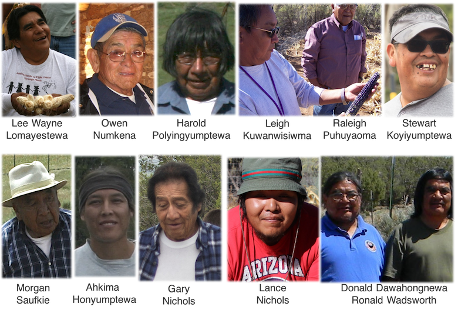

## PFP Funding
<div class="columns-2">
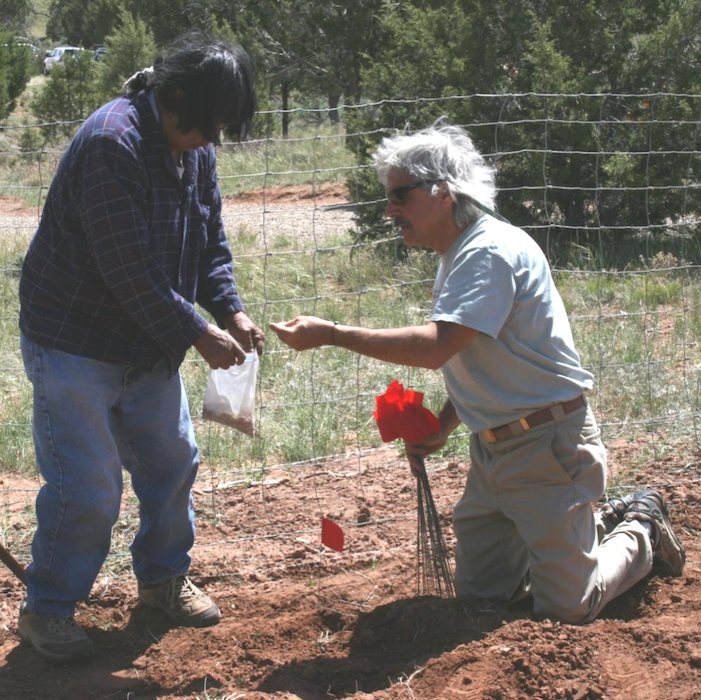
<br>


</div>

## The PFP Fields
```{r, echo=FALSE}
garden_locations@data <- cbind(garden_locations@data, rgeos::gCentroid(garden_locations, byid=T)@coords)

gardens_m <- leaflet::leaflet(garden_locations,
                              width = "100%",
                              height = 459) %>%
  leaflet::addProviderTiles("Esri.WorldImagery", group = "Satellite") %>%
  leaflet::addProviderTiles("Esri.WorldTopoMap", group = "Topography") %>%
  leaflet::addMarkers(lng = ~x,
                      lat = ~y,
                      popup = ~Popup
  ) %>%
  leaflet::addLayersControl(
    baseGroups = c("Satellite", "Topography"),
    options = leaflet::layersControlOptions(collapsed = T)
  )

gardens_m
```

<!-- ## The PFP Fields -->
<!-- 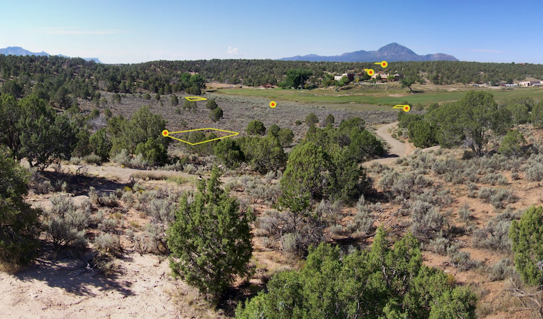 -->

## The Check Dam Garden
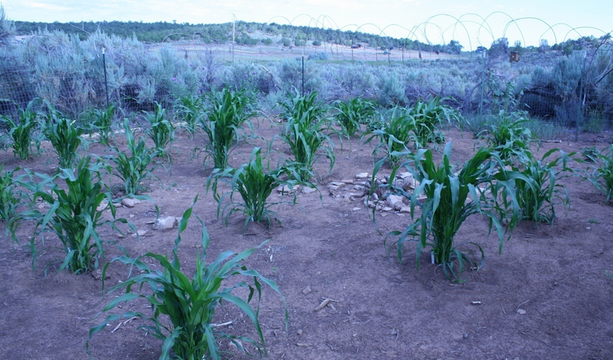

## Paul's Old Garden
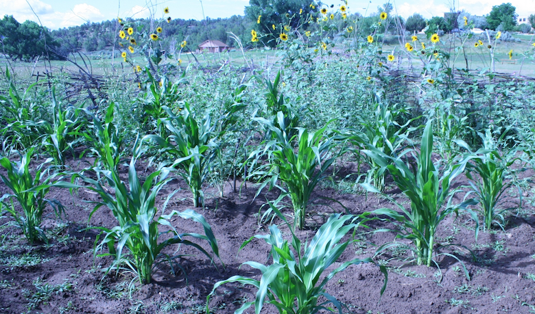

## The Pueblo Learning Center Garden
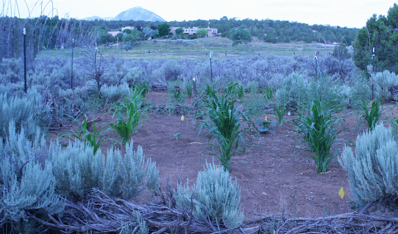

## The Pit House Garden
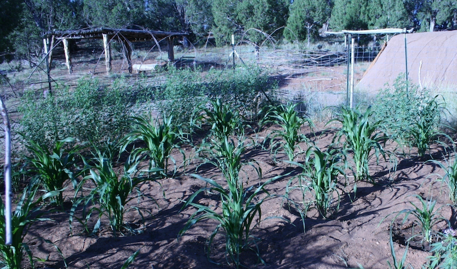

## Karen's Upper Garden
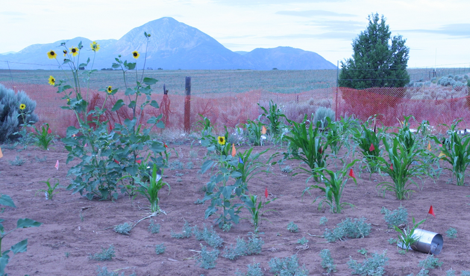

## The Mike Coffey Garden
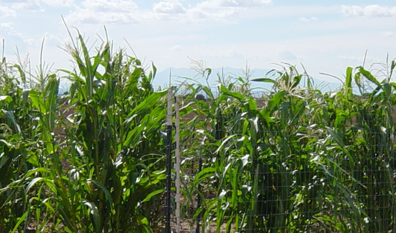

## Hopi Farming Practices
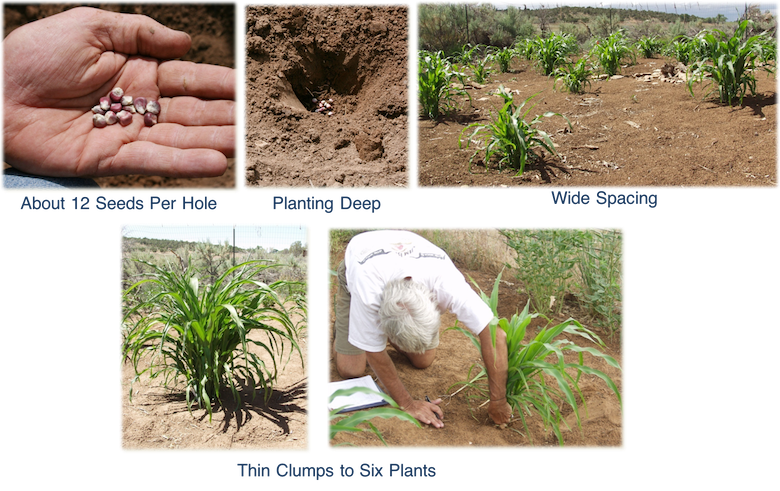

## More Than Planting a Seed
<iframe src="https://www.youtube.com/embed/2x23FF_kUyo?start=155&end=188" width="420" height="315" frameborder="0" allowfullscreen=""></iframe>

## Maize Growth
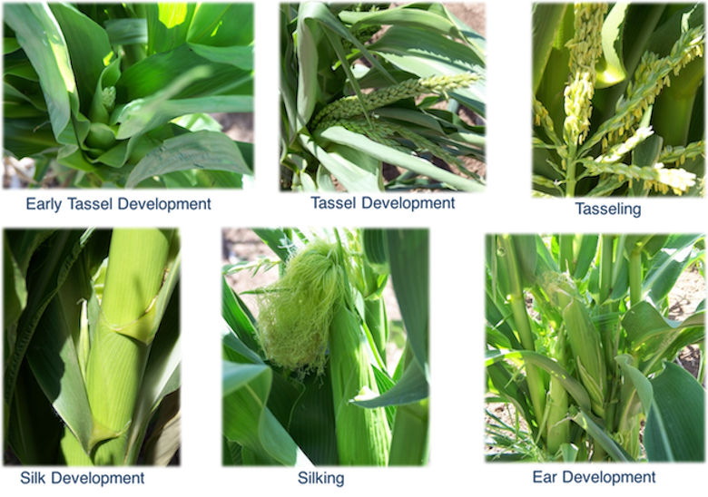

## Maize Growth
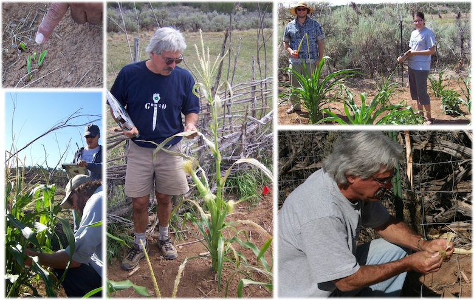

## Maize Growth
```{r, echo=FALSE}
shinyAppDir(
  "shiny/maize_growth",
  options=list(
    width="100%", height=700
  )
)
```

<!-- ## Ear Size -->
<!-- ```{r, echo=FALSE} -->
<!-- shinyAppDir( -->
<!--   "shiny/ear_diversity", -->
<!--   options=list( -->
<!--     width="100%", height=700 -->
<!--   ) -->
<!-- ) -->
<!-- ``` -->

## Maize Yields
```{r, echo=FALSE}
shinyAppDir(
  "shiny/maize_yields",
  options=list(
    width="100%", height=700
  )
)
```

## Game-plan
- Introduction to the Pueblo Farming Project
- **Understanding the Past: Calibrating the VEP**
- Evolving Resiliency: Genetics Studies
- Preparing for the Future: Revitalizing Sustainability

## The Village Ecodynamics Project
<div class="centered">
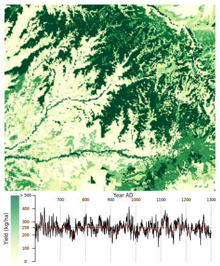
</div>

## Bocinsky and Varien 2017
<div class="centered">
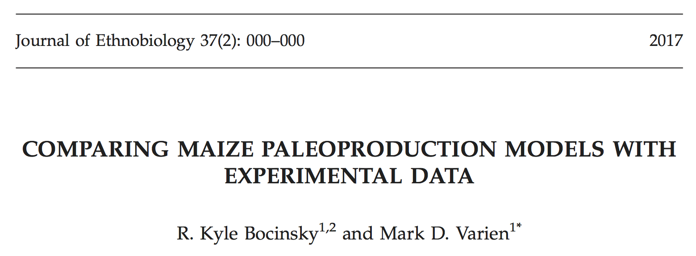
</div>

## The PFP Soils
```{r, echo = FALSE}
## Define the display layers
display_layers <- paste0("X",2009:2016)
names(display_layers) <- 2009:2016

## Create color palettes for each soil layer
colorpal <- leaflet::colorNumeric(
  palette = "RdYlGn",
  c(0,700))

## Create map that allows people to color by different layers
# Create the basemap
yields_m <- leaflet::leaflet(soils_VEPII_yields,
                             width = "100%",
                              height = 459) %>%
  leaflet::addProviderTiles("Esri.WorldImagery", group = "Satellite")

# Add layers for each soil quality
# i <- 2
for(i in 1:length(display_layers)){
  yields_m <- yields_m %>%
    leaflet::addPolygons(fillColor = ~colorpal(soils_VEPII_yields[[display_layers[i]]]),
                         fillOpacity = 0.7,
                         color = "white",
                         weight = 3,
                         opacity = 1,
                         smoothFactor = 0.5,
                         popup = ~Popup,
                         group = names(display_layers)[i]
    )
}

# Add a layer for gardens
yields_m <- yields_m %>%
  leaflet::addMarkers(data = garden_locations,
                      lng = ~x,
                      lat = ~y,
                      popup = ~Popup,
                      group = "Gardens"
  )

## Add the control box
yields_m <- yields_m %>% leaflet::addLayersControl(
  baseGroups = names(display_layers),
  overlayGroups = c("Gardens"),
  options = leaflet::layersControlOptions(collapsed = T, autoZIndex = F)
)

## Add the legend
yields_m <- yields_m  %>%
  leaflet::addLegend(position = "bottomright",
                     pal = colorpal, values = c(0,700))

## Fit the bounds to the soils
yields_m <- yields_m  %>%
  leaflet::fitBounds(lng1 = raster::xmin(soils_VEPII_yields),
                     lat1 = raster::ymin(soils_VEPII_yields),
                     lng2 = raster::xmax(soils_VEPII_yields),
                     lat2 = raster::ymax(soils_VEPII_yields))

yields_m  # Print the map
```

## Soil Moisture
```{r, echo=FALSE}
shinyAppDir(
  "shiny/soil_moisture",
  options=list(
    width="100%", height=700
  )
)
```

## Weather in Cortez
```{r, echo=FALSE}
shinyAppDir(
  "shiny/cortez_weather",
  options=list(
    width="100%", height=700
  )
)
```

## Comparison with VEP
<div class="centered">
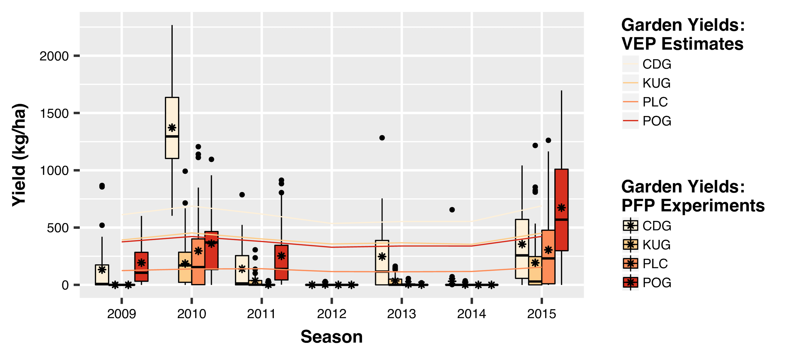
</div>

## Comparison with VEP
- Hopi maize **flourishes** in Southwestern Colorado
- PFP experimental yields are **highly correlated** with VEP estimates
- PFP data can be used to refine VEP models

## Game-plan
- Introduction to the Pueblo Farming Project
- Understanding the Past: Calibrating the VEP
- **Evolving Resiliency: Genetics Studies**
- Preparing for the Future: Revitalizing Sustainability

## Maize Diversity
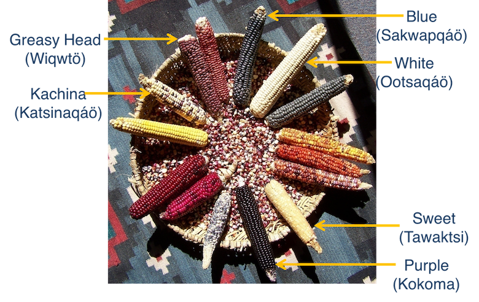

## Evolving Resiliency
<div class="centered">

</div>

## Genetics Study
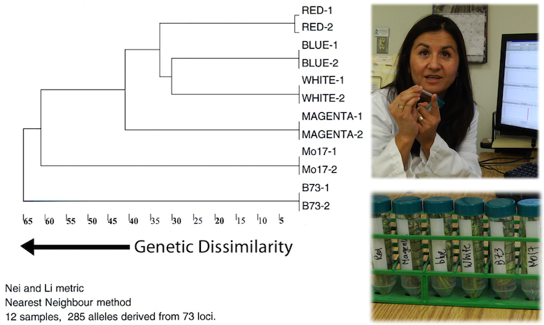

## Genetics Study
- Protecting and preserving Hopi intellectual property
- Line of evidence for establishing cultural affiliation
- Revealing the *processes* of adaptation

## Game-plan
- Introduction to the Pueblo Farming Project
- Understanding the Past: Calibrating the VEP
- Evolving Resiliency: Genetics Studies
- **Preparing for the Future: Revitalizing Sustainability**

## Revitalizing Sustainability
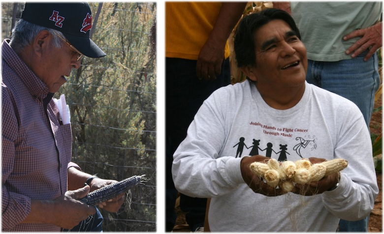

